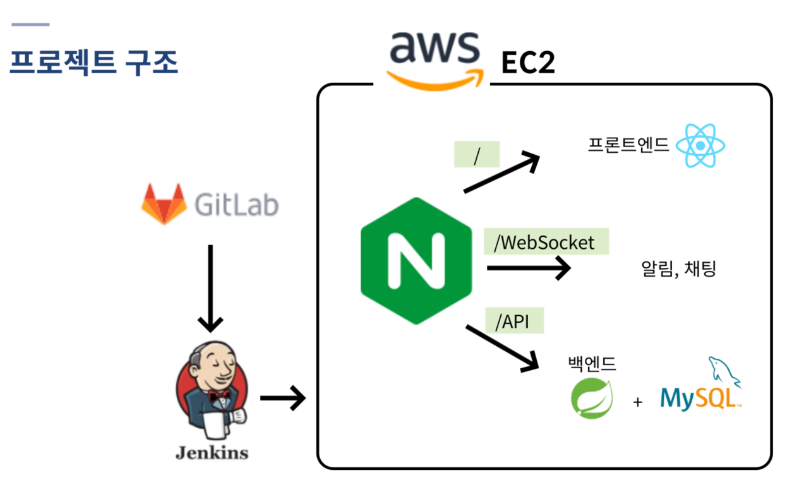
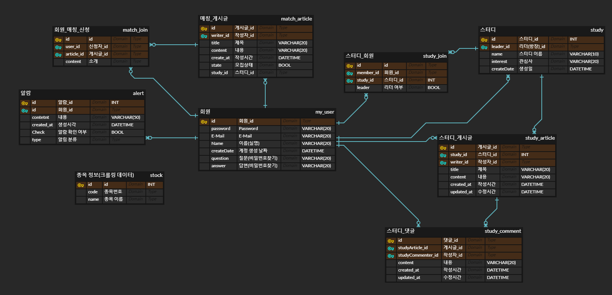

# 개미 키우기

<!-- 필수 항목 -->

## 프로젝트 소개

* 프로젝트명: 개미 키우기
* 서비스 특징: 주식 스터디 관리 서비스
* 주요 기능
  - 계정 관리
  - 검색 기능
  - 매칭 기능
  - 스터디 공간
  - 주식 검색
  - 게시글에 주가 기록
* 주요 기술
  - Single Page Application
  - REST API
  - WebSocket
* 배포 환경
  - URL: http://i6d207.p.ssafy.io/ 
  - Swagger: http://i6d207.p.ssafy.io/api/swagger-ui.html
  - 테스트 계정: master@naver.com
  - 테스트 계정 비밀번호: 1q2w3e4r!Q

<!-- 자유 양식 -->

## 팀 소개

### 프론트엔드

* 김병준: UCC, 기록/정리, Redux
* 김준하: Redux, CRUD UI, WebSocket
* 임현모: 주식정보 UI, 뉴스피드, 소셜로그인(카카오)

### 백엔드

* 서상용: 팀장, 배포, 기본 CRUD, WebSocket
* 김덕규: JWT, 크롤링, 유저 CRUD

<!-- 자유 양식 -->

## 프로젝트 상세 설명

### 개발 환경

- jdk: 13.0.1
- sts(Spring Tool Suite 3) Version: 3.9.14.RELEASE
- vscode
- MySQL 8
- React 17.0.2, Redux 7.2.6, React-router 6.2.1

### 기술 스택

- React.js, Redux
- SpringBoot, JPA, jsoup
- MySQL
- Websocket
- Jenkins, Nginx, AWS EC2

### 협업 툴

- Git, Jira, notion
- MM, Discode
- 구글문서, figma, erdcloud

### 프로젝트 구조

### ERD

### 기능 상세 설명

#### 매칭

- 스터디에서 모집글 작성
  - 모집글에 신청 -> 승인
- 스터디에서 이메일 계정으로 초대

#### 스터디

- 주식 종목 첨부
- 첨부 시점과 현재(크롤링)의 주가를 비교하여 변동금액 계산

#### 주식 검색

- 코스피, 코스닥 기업의 기본 정보 검색
  - 주가 등 주식 정보
  - 관련 뉴스
