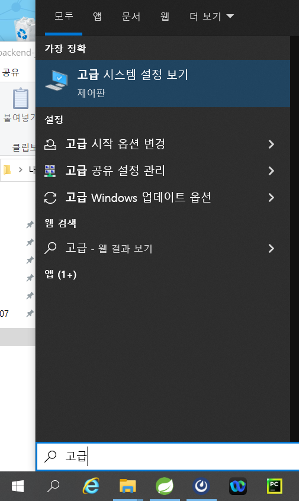
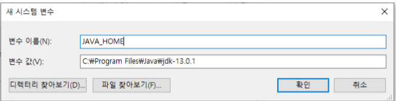
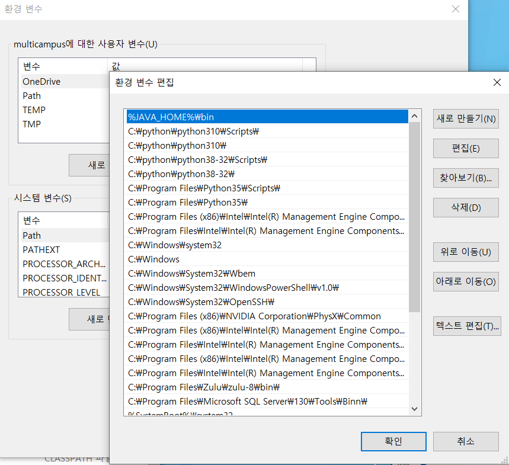

# 웹 디자인 Backend

<!-- 필수 항목 -->

## 소개

웹 디자인 프로젝트의 Backend 스켈레톤 코드 기반

<!-- 필수 항목 -->

## 기술스택 및 라이브러리

| Project | Version | Description |
| ------- | ------- | ----------- |
| Java    | 1.8     |             |
| Maven   | 3.8.4   | Build Tool  |
| MySQL   |         |             |
|         |         |             |

<!-- 필수 항목 -->

## 개발 환경 구성

Windows 기준 개발 환경 구성 설명

1. OpenJDK 설치
   1. JDK 다운로드 사이트에서 13.0.1 압축 파일 다운로드
      - [jdk.java.net/archive/](https://jdk.java.net/archive/)
      
      - 원하는 설치 경로에 압축해제
        (예 - C:\Program Files\Java\jdk-13.0.1)
      
      - 환경 변수 설정
      
        - [고급 시스템 설정 보기] - [환경변수]
      
          
      
        - 시스템 변수의 [새로 만들기]를 클릭하여 시스템 변수 추가
      
          
      
        - 시스템 변수의 Path 편집 - `%JAVA_HOME%bin` 추가
      
          
      
   2. 설치 후 명령 프롬프트(cmd) 확인
      ```
      > java -version
      ```
      출력 예)
      ```
      openjdk version "13.0.1" 2019-10-15
      OpenJDK Runtime Environment (build 13.0.1+9)
      OpenJDK 64-Bit Server VM (build 13.0.1+9, mixed mode, sharing)
      ```
   
2. STS 설치
   
2. MySQL 설치
   
   - 설치 후 sql파일 실행
   
4. 스켈레톤 다운로드 및 설정

   1. 프로젝트 다운로드
      ```
      git clone <repo URL>
      ```

   4. src/main/resources/application.properties 수정

      ```
      spring.datasource.username=<사용자 계정>
      spring.datasource.password=<비밀번호>
   ```
   


## 디렉토리 구조

```
.
└─src
    ├─main
         ├─java
         │  └─com
         │      └─web
         │          └─curation
         │              ├─config  /* Spring Config 파일 */
         │              ├─controller  /* Controller 단위의 클래스 */
         │              ├─dto /* 데이터 전송 객체(Data transfer object) */         
         │              ├─model  /* 객체 모델 클래스 */
         │              ├─repository /* DB 연결 */
         |				└─service
         └─resources
```

