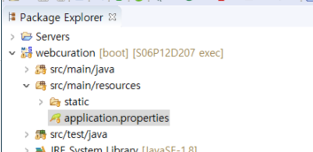
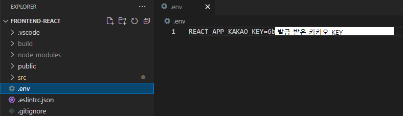
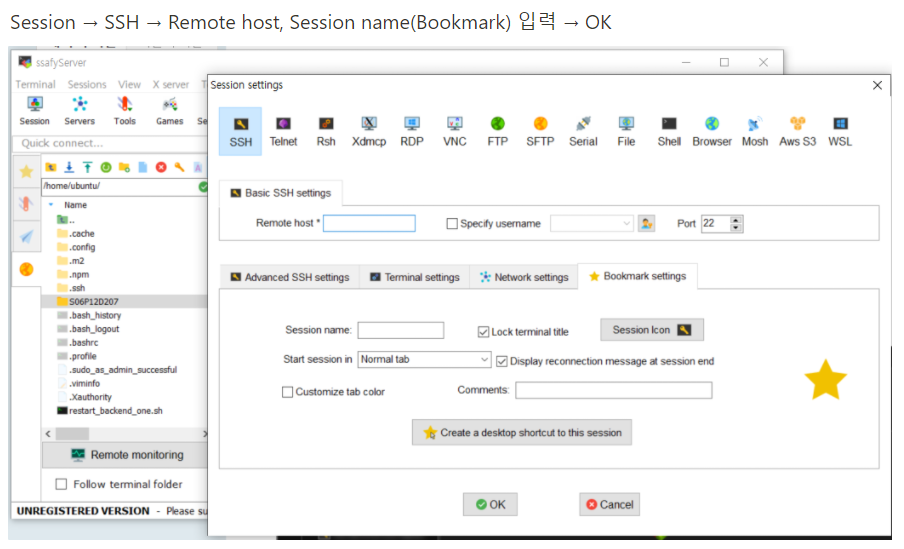
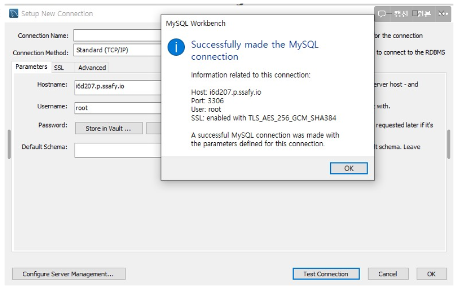
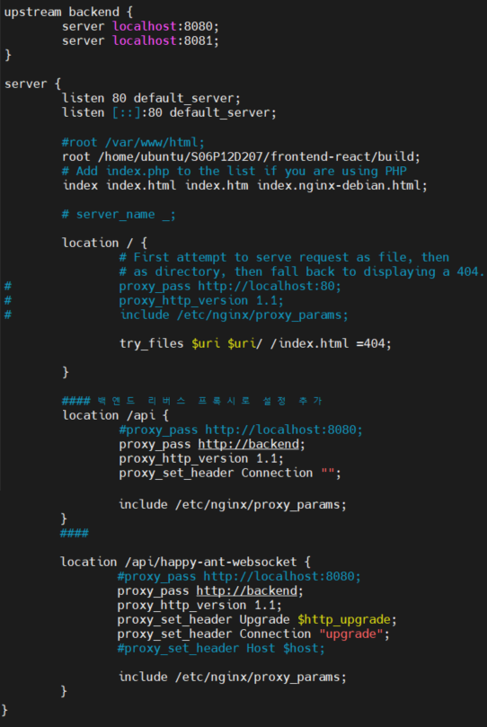

# 포팅 매뉴얼


## 준비

MySQL 8

vscode

sts(Spring Tool Suite 3) Version: 3.9.14.RELEASE

jdk: 13.0.1

lombok 설치


## 로컬에서 실행

git clone


### React

npm install

npm start


### SpringBoot

#### MySQL 설치

- 스키마 이름: ssafydb

- 유저이름: ssafy

- 유저비밀번호: ssafy


#### sts

sts로 `backend-java` 메이븐 프로젝트  import

properies 파일에서 



- `spring.jpa.hibernate.ddl-auto = create` 주석해제하여
  실행하면 테이블 생성됨, 이후 실행부터는 다시 주석 필수

- 로컬DB로 확인하려면 `spring.datasource.url=jdbc:mysql://localhost:3306/`

#### MySQL 설정

- stock테이블 우클릭 -> Import 선택 -> exec 폴더에 있는 stock.csv 파일의 데이터를 stock 테이블에 Import

- 


## 빌드

### 로컬

#### 프론트엔드

##### .env

- 카카오 로그인을 위한 KEY 환경변수를 담음

  [소셜 로그인 키 받기](소셜 로그인) 참고

- 파일 생성하여 frontend-react 폴더에 넣기

  - 서버에서 빌드할 때는 따로 업로드해야함

  

##### 빌드

- frontend-react 폴더 안에 'build 폴더'가 생김

```bash
npm install
npm run build
```


#### 백엔드

```bash
./mvnw package
```

backend-java/target 에 'jar 파일' 생김


## 배포

### EC2 서버

#### EC2 접속

- 개인키가 담긴 인증서(cert.pem) 파일 생성 

- 두 가지 방법

  1. git bash

     `ssh -i cert.pem ubuntu@i6dXXX.p.ssafy.io`

  2. SSH 접속 프로그램 (MobaXterm)

     https://mobaxterm.mobatek.net/

     

     Remote host: EC2 주소 (예시, ubuntu@i6dXXX.p.ssafy.io )

     Session name: 자유롭게 지정 가능

#### 서버에 mysql 설치

```
// 우분투 서버 업데이트 및 MYSQL server 설치
$sudo apt-get update
$sudo apt-get install mysql-server

// MYsql 기본 세팅
$sudo ufw allow mysql
// 실행전에 우분투 비밀번호 설정
sudo password root
// 실행
$sudo systemctl start mysql
// 서버 시작시 mysql 시작
$sudo systemctl enable mysql

// mysql 접속
$sudo /usr/bin/mysql -u root -p

// mysql 버전 확인
mysql> show variables like "%version%";
// mysql 비밀번호 변경
mysql> SET PASSWORD FOR 'root'@'localhost' = PASSWORD('새 비밀번호');

// 연결할 계정 생성
mysql> create user 'ssafy'@'%' identified by 'ssafy';
mysql> grant all privileges on *.* to 'ssafy'@'%' with grant option;
```

로컬에서 설치한 mysql workbench -> 새 커넥션 생성

- Hostname: ec2 서버 주소
- Username: ssafy
- Password:  ssafy
  - Store 눌러서 저장



[여기서](###SpringBoot) 설정했던 `spring.datasource.url`을  
localhost -> EC2주소로 수정해야 백엔드와 서버 DB 연결됨

[MySQL 설정](####MySQL 설정)도 해야 함


### 수동 배포

EC2 서버에서 git clone

#### 프론트 빌드

frontend-react에서 

`npm install`

`npm run build`


#### 서버에 nginx 설치

```
// 설치
sudo apt install nginx

// ngnix 설정(아래 코드로 수정)
sudo vi /etc/nginx/sites-enabled/default
```



```
#설정 변경 후 재시작
sudo service nginx restart
#or
sudo systemctl restart nginx

#상태확인: Active: active (running)
#sudo systemctl status nginx
```


#### 백엔드 빌드

backend-java에서

`sudo apt install openjdk-13-jre-headless`

`chmod +x mvnw` (권한 부여)

`./mvnw package` (빌드)


백엔드 재시작 스크립트 작성

`vi ~/restart_backend_one.sh`

```
#!/bin/bash
# SDKMAN only for java
#source "/home/ubuntu/.sdkman/bin/sdkman-init.sh"
kill $(pgrep -f app1.jar)
nohup java -jar app1.jar --server.servlet.context-path=/api \
--server.address=127.0.0.1 --server.port=8080 >> app1.log 2>&1 &
# pid 생성 기다리기
sleep 2
echo "complate deploy app1 pid=$(pgrep -f app1.jar)"
```

```
# 실행권한 추가 후 테스트
chmod +x ~/restart_backend_one.sh
# 실행 테스트
~/restart_backend_one.sh
```

- 아래처럼 pid가 없으면 제대로 실행안된 상태

  

- 정상적으로 실행된 상태

  

- 실행 확인

  `netstat -lnpt` 

  

  


### 

