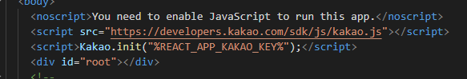

# README (카카오톡/ 구글)

# 카카오톡 로그인 키 발급

[https://dEvElopErs.kakao.com/](https://dEvElopErs.kakao.com/)

[Kakao DEvElopErs](https://dEvElopErs.kakao.com/)

카카오 개발자 사이트 접속

애플리케이션 추가

JavaScript 키 복사

WEb 플랫폼 등록해서 http://localhost:3000 입력

카카오 로그인 활성화 설정 상태 ON

이어서 REdirEct URI에 http://localhost:3000/oauth 입력

동의항목 닉네임, 이메일 선택(사업자 번호 없어서 이메일 필수동의 못함)

아까 받은 JavaScript 키를 복사하여 개미키우기 프로젝트의 indEx.html 에 있는 Kakao.init 안에 붙여넣으면 사용 가능

# Env

환경변수를 이용할 경우 .Env 파일을 만들어서 아래와 같이 키를 환경변수에 저장해 놓아도 사용 가능

