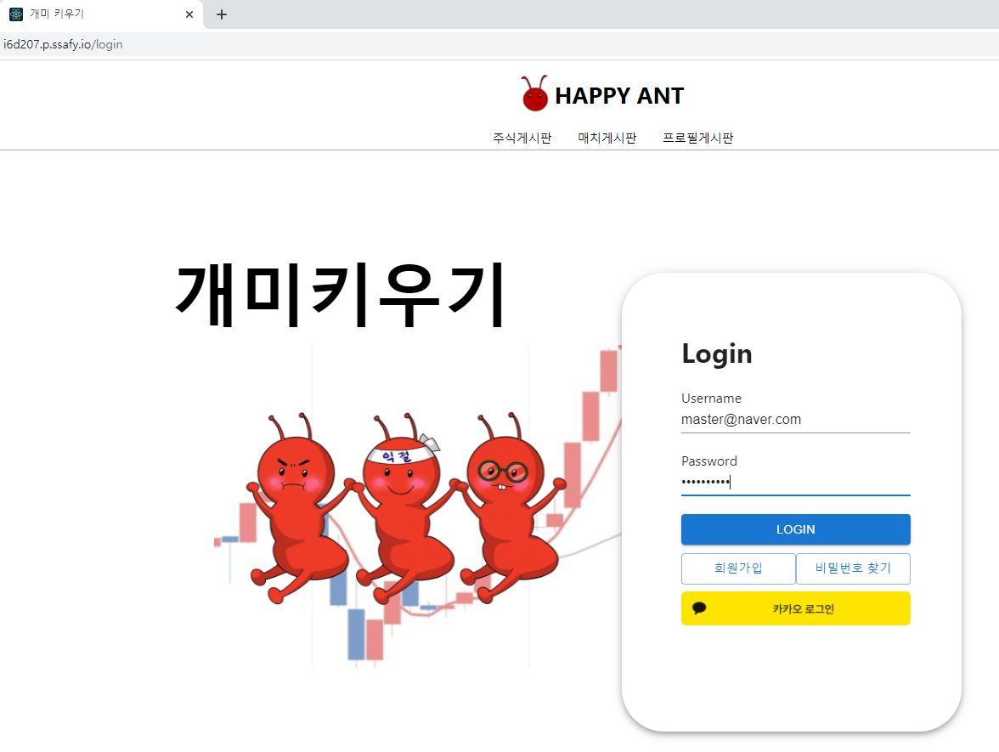

## 로그인

- 테스트 계정으로 로그인
  - master@naver.com
  - 1q2w3e4r!Q

- 로그인을 하면 프로필로 이동



### 프로필

- 스터디 이동


## 스터디

### 주식종목이 첨부된 게시글

왼쪽에는 저장했던 주가 기준 변동상황

오른쪽에는 크롤링으로 네이버 증권에서의 데이터를 가져옴


### 게시글 작성


#### 종목 검색 및 저장


#### 액셀 데이터 붙여넣기


#### 액셀 데이터로 차트 넣기

- 마크다운 모드에서 작성

  ```
  $$ chart
  액셀 데이터
  $$
  ```

  

